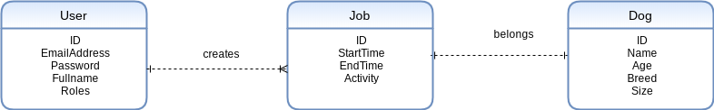
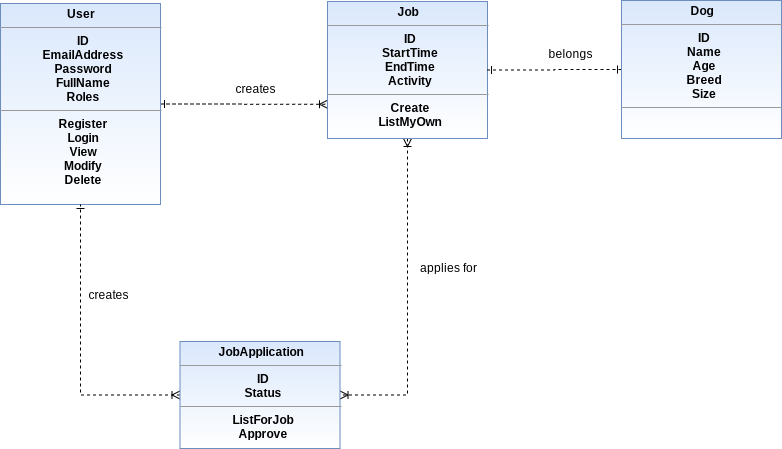

# Initial Study PetsApi Application

    An application that allows pet owners to post jobs for their pet dogs
    and pet sitters to apply for the jobs.

## HighLeveL Functional and Non-Functional Requirements

    - Sign up: as a dog owner or dog walker
    - Dog owners can post jobs
    - Dog walkers can apply for posted jobs
    - Build web app with in-house team - two people
    - Mobile app - work with other development agency (Later!)
    - Chance to experiment with new technology
    - Release first working prototype as soon as possible

## Information Requirements

    - Pet owners | User model | ID, Email address, Password, FullName, User role: owner,sitter,admin
    - Pet sitters | User model
    - Jobs | Job model | ID, StartTime, EndTime, Activity
    - JobApplication | JobApplication model
    - Dog | Dog model | Name, Age, Breed, Size

## First Draft Analysis Model

## User Stories

    Pet owner user stories

        - I can register a new account and choose my role, so that I can log in.
        - I can log in to my account, so that I can use the marketplace.
        - I can post a job on PetSitter, including a description of one of my dogs, so that
          pet sitters can apply.
        - I can see a list of jobs I have posted.
        - Given that I have posted a job, I can view and modify its details
        - Given that I have posted a job, I can delete it.
        - Given that I have posted a job, I can see the pet sitters that applied.
        - Given that I have found a suitable candidate, I can approve them.
        - I can modify my account details.
        - I can delete my account.

    Pet sitter user stories

        - I can register a new account and choose my role, so that I can log in.
        - I can log in to my account, so that I can use the marketplace.
        - I can view a list of pets that need looking after.
        - Given that I have found a job, I can apply for it.
        - I can modify my account details.
        - I can delete my account.

    Admin Role

        - I can log in to my account, so that I can access the admin functionality.
        - I can modify my account details.
        - I can modify other users’ account details.
        - I can edit jobs that other users have posted.
        - I can delete users.

# Design

## Object Model

